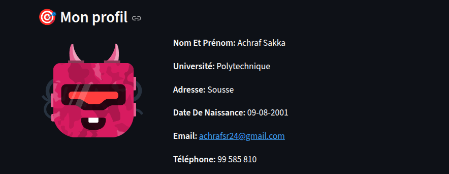

# 🧠 Profile Extractor NLP – Streamlit App

Cette application permet d’extraire automatiquement un **profil structuré** à partir d’un texte libre.  
Elle utilise des techniques de **Traitement Automatique du Langage (NLP)** avec **spaCy**, des **regex intelligentes**, et une interface web moderne construite avec **Streamlit**.

---

## 🚀 Fonctionnalités

### ✔️ Extraction automatique des informations suivantes :
- **Nom complet**
- **Date de naissance** (formats variés : `05/08/2002`, `5 août 2002`, `5 August 2002`…)
- **Université / école**
- **Ville / lieu de résidence**
- **E-mail**
- **Numéro de téléphone**

### ✔️ Normalisation automatique :
- Nettoyage du texte (accents, espaces…)
- Uniformisation des dates → format `DD-MM-YYYY`

### ✔️ Modèle NLP utilisé
- `spaCy - fr_core_news_lg` (meilleure précision : NER, segmentation…)
- Couplé avec des **regex personnalisées** pour augmenter la précision (université, localisation, nom…).

### ✔️ Interface utilisateur (UI)
- Saisie d’un texte libre
- Bouton de génération de profil
- Affichage élégant du profil structuré
- **Avatar IA généré automatiquement** (via *randomuser.me*)

---

## 🏗️ Architecture du projet

📦 NLP_Profile_Extractor
┣ 📜 appNLP.py
┣ 📜 requirements.txt
┣ 📜 README.md
┗ 📁 assets (optionnel)

---

## 🛠️ Installation

### 1️⃣ Cloner le projet

git clone https://github.com/username/your-repo.git
cd your-repo

### 2️⃣ Créer un environnement

conda create -n nlp_env python=3.11
conda activate nlp_env

### 3️⃣ Installer les dépendances

pip install -r requirements.txt

-->spaCy installera automatiquement le modèle fr_core_news_lg grâce au lien dans requirements.txt.

### ▶️ Lancement de l’application

streamlit run appNLP.py

### 🧩 Exemple de texte à tester

Resultat obtenu:

### 🧪 Technologies utilisées
| Technologie         | Rôle                   |
| ------------------- | ---------------------- |
| **Python**          | Langage principal      |
| **spaCy**           | NER / NLP              |
| **fr_core_news_lg** | Modèle français avancé |
| **Regex**           | Extraction robuste     |
| **Streamlit**       | Interface web          |
| **Requests**        | Avatars IA             |

### 📌 Objectif du projet

Ce projet a été conçu pour :

pratiquer le text mining

comprendre le NER + regex hybrides

construire une application NLP complète

obtenir un pipeline clair : Nettoyage → Normalisation → Extraction → UI

Il peut être utilisé dans :

onboarding utilisateurs

analyse de CV

formulaires intelligents

assistants RH ou IA

### 📬 Auteur

👤 Achraf Sakka Rouis
Étudiant en Data Science & Intelligence Artificielle
Projet réalisé pour un travail universitaire & pratique NLP.

### ⭐ Contribuer

Les contributions sont les bienvenues.
N’hésitez pas à proposer :

amélioration du modèle NER

ajout de nouvelles entités (skills, nationalité…)

meilleure interface Streamlit

support multilingue

### 📄 Licence

Ce projet est sous licence MIT.
Vous êtes libre de le réutiliser, le modifier et le distribuer.
